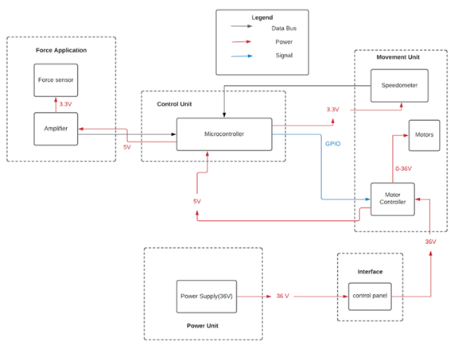
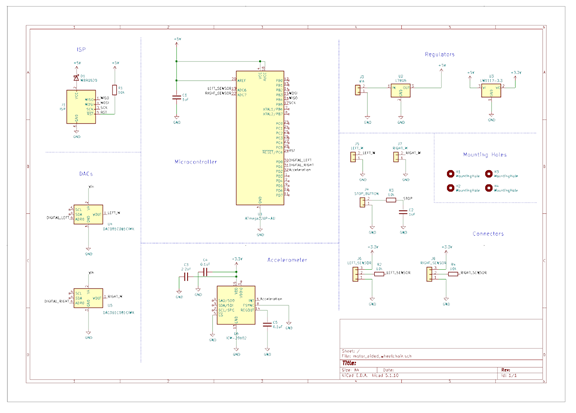
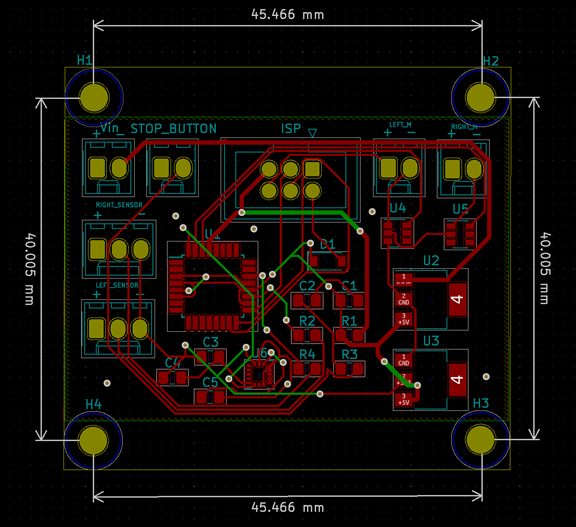

# Motor-Aided Wheelchair

## Background

Nowadays, motorized wheelchairs are becoming more widespread, but there remain people with disabilities
that need more care who are not able to control the motorized wheelchairs themselves. In such situations,
an ordinary motorized wheelchair controlled by the person sitting in is unlikely to help, given the fact that
the medical personnel or family members who push the wheelchair could not be benefited. Therefore,
developing a motor-aided wheelchair that gives feedback assistive power to the wheels makes people easier
to push.

## Block Diagram

## Schematic

## PCB

## Demo Video

