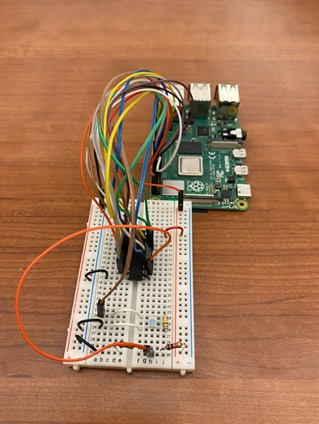

# Li-Fi Communication Model

Li-Fi (Light-Fidelity) is a wireless communication technology that transmits and receives data by light, which is capable of transmitting data at high speeds over the visible light (mainly), ultraviolet, and infrared spectrums.

## Receiver Circuit

## Demo Video

